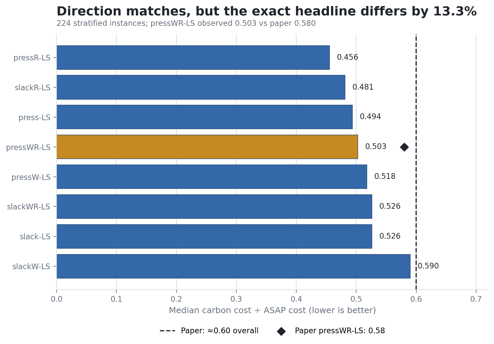
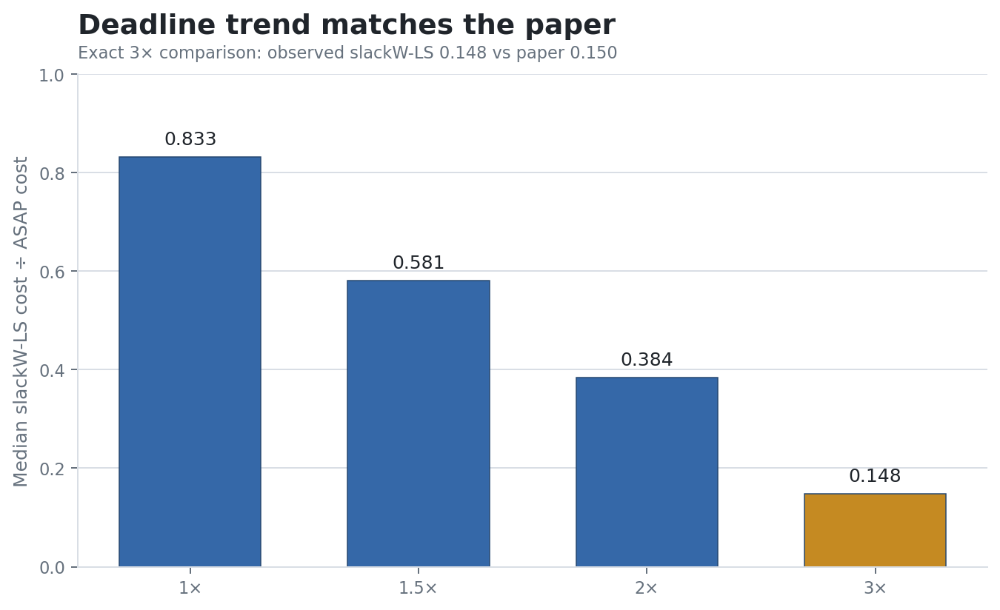
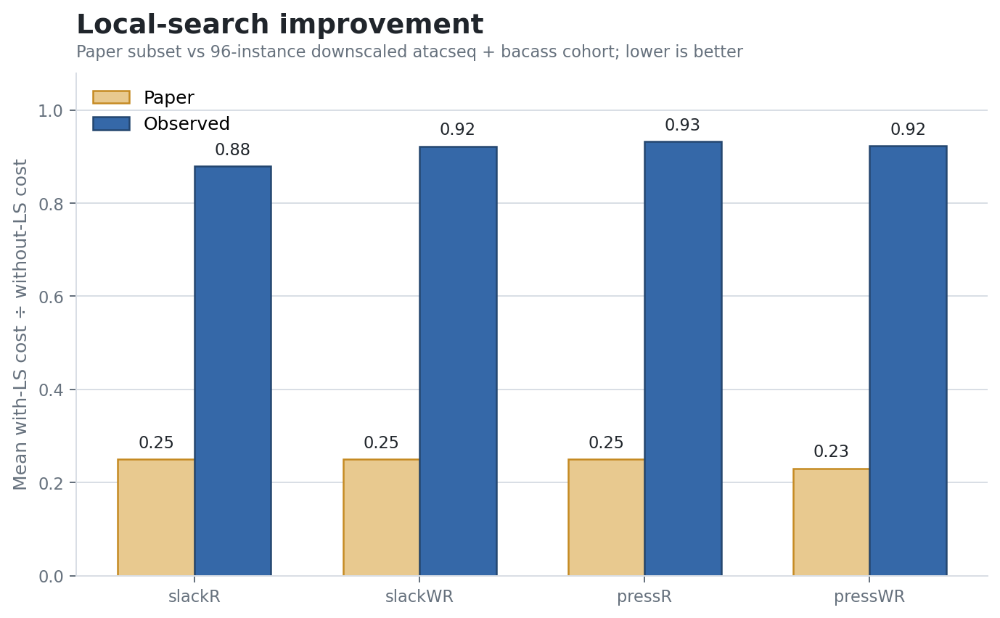
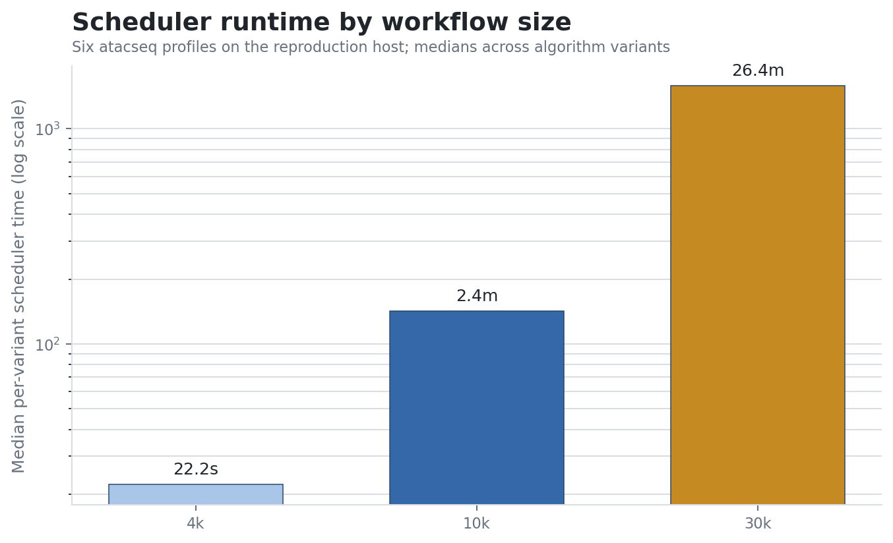
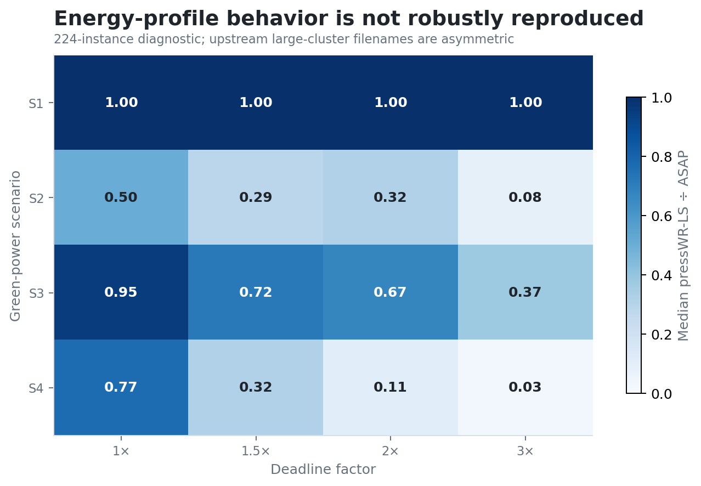

# CaWoSched 统一标准复现审计：最终等级 C



**最终判定：C（部分复现成功），结论可信度：中。** 本次确有来自正式代码运行的有效结果，但不能称为完整或缩小规模复现成功：部分核心方向得到支持，`pressWR-LS`、排名比例等精确数值超过 10% 参考差异，局部搜索增益相差 252%–301%，ILP 结论未测试，部分参数影响也不一致。

## 1. 本次实际复现了什么？

本次从作者官方仓库的当前 C++ 代码编译调度器，并在官方 DAG、固定映射和能源/截止时间配置上运行了：

- 224 个主实验实例：7 个工作流/规模组、大小两种集群、4 种能源情景、4 个截止时间；
- ASAP 基线、8 个带局部搜索的启发式、8 个对应的不带局部搜索版本；
- 6 个额外运行时间实例，覆盖 4k、10k 和 30k 任务；
- 共 3,910 条调度结果，全部通过程序自身的可行性检查。

正式命令为：

```bash
bash reproduction/run.sh
```

正式运行耗时 7 小时 47 分。运行使用 Vast.ai RTX 3090 实例的 CPU；调度器本身不使用 GPU。

## 2. 实验真实性检查

结果真实性通过，但这只说明结果确实来自本次运行，并不等于论文结论已复现。

| 检查 | 结果 | 解释 |
|---|---:|---|
| 日志中的实例进度 | 230/230 | 224 个主实例 + 6 个时间分析实例 |
| 原始结果行数 | 3,910 | 精确等于 $224\times17+6\times17$ |
| 唯一结果键 | 3,910 | `(cohort, instance, mode, variant)` 无重复 |
| 无效调度 | 0 | 每行 `valid=True` |
| 每个主实例的方法覆盖 | 完整 | 1 个 ASAP + 8 个带 LS + 8 个不带 LS |
| 局部搜索使成本上升 | 0 次 | 符合 hill-climber 的实现约束 |

运行日志先记录编译器、配置、230 个实例的执行进度，再输出逐实例成本和耗时。`results.csv` 是从该日志的 `RESULT_CSV` 区段提取的；观察值由这些实际成本重新聚合。论文参考值只用于并排比较，不参与生成观察值。

一个重要口径风险是：224 个主实例中有 41 个 ASAP 成本为零。若启发式也为零，本报告沿用运行脚本的约定，将 $0/0$ 比率记为 1；没有出现 ASAP 为零而启发式为正的未定义比率。该约定可能影响中位数，应在全量复现时与论文脚本逐行核对。

## 3. 核心结论逐项判断

论文没有为这些汇总指标提供方差或置信区间，因此按用户指定规则，以相对差异不超过 10% 作为临时数值接近标准：

$$
\text{相对差异}=\frac{|\text{复现值}-\text{论文值}|}{|\text{论文值}|}.
$$

| 核心结论 | 论文结果 | 本次结果 | 方向 | 相对差异 | 是否支持 |
|---|---:|---:|---|---:|---|
| 启发式显著优于 ASAP；`pressWR-LS` 中位比率最佳 | `pressWR-LS` 0.580；各方法约 0.60 | `pressWR-LS` 0.503；各方法 0.456–0.590 | 一致 | **13.3%** | **部分支持**：方向一致，精确值超过 10% |
| ASAP 通常排名最差 | 84.01% | 95.98% | 一致 | **14.3%** | **部分支持** |
| `pressWR-LS` 最常排名第一 | 34.47% | 39.73% | 一致 | **15.3%** | **部分支持** |
| 截止时间越宽松，碳成本越低 | 3× 时 `slackW-LS` 0.150 | 0.833 → 0.581 → 0.384 → **0.148** | 一致且单调 | **1.4%**（3×） | **支持** |
| 局部搜索大幅改善初始解 | `slackR/slackWR/pressR` 0.25，`pressWR` 0.23 | 0.879 / 0.922 / 0.932 / 0.923 | 改善方向一致 | **252% / 269% / 273% / 301%** | **不支持论文报告的增益幅度** |
| 集群规模对启发式表现无显著影响 | 无精确汇总值 | 大集群中位比率比小集群高 29%–54% | 不一致 | 无法按论文数值计算 | **本子集不支持**；未做论文同款显著性检验 |
| 任务数增大时成本比率略变差 | 定性结论 | atacseq/eager 从 200 到 1000 反而改善；methylseq 略变差 | 混合 | 无论文精确值 | **结论不充分** |
| 多数实例数秒完成，30k 至数分钟 | 数秒至数分钟 | 4k 22.2 秒；10k 2.4 分；30k 26.4 分 | 随规模增长方向一致 | 论文无精确值 | **部分支持**；绝对耗时明显更长 |
| 启发式在小实例上接近 ILP 最优解 | 接近最优，部分精确最优 | 未运行 | 未检查 | 不适用 | **未复现** |

因此，不能仅凭主图方向一致就给出 B。至少一个关键机制结论——局部搜索带来的大幅增益——在数值上明显不一致，另有 ILP 结论缺失、参数鲁棒性证据混合。

## 4. 关键证据

### 截止时间趋势得到支持



这是数值最接近的核心结论。使用与论文相同的 `slackW-LS` 变体，本次 3× 截止时间比率为 0.1479，论文为 0.15，相对差异 1.4%。四个截止时间点也呈单调下降。

### 局部搜索增益幅度没有得到支持



比率定义为“带局部搜索成本 ÷ 不带局部搜索成本”，越低代表增益越大。本次 96 个匹配的 atacseq + bacass 实例确实全部满足局部搜索不增大成本，但均值只有轻微改善；与论文超过 400 个实验/变体的 0.23–0.25 相距很大。

### 运行时间只在趋势上部分一致



任务规模增大导致耗时快速增加，这一方向一致。但 30k 任务的中位每变体耗时达到 26.4 分钟，明显超出论文的“数分钟”。此外，本次 3× 截止时间相对 1× 使三个规模的中位时间增加约 35%–76%，不能直接支持论文所说的“只略微增加”。

### 能源情景结果不够稳健



论文称 S1/S3 的收益更明显，而本次聚合结果中 S1 多数为 1，S4 在宽松截止时间下反而最强。上游大集群配置还存在 `setting2_..._1` 与 `setting2_..._2` 的文件名前缀不对称，因此该比较既没有支持论文方向，也不适合据此反驳论文；应先恢复论文精确的 simexpal 清单与情景映射。

## 5. 实验条件差异及可能影响

| 条件 | 论文 | 本次 | 可能影响 |
|---|---|---|---|
| 数据来源 | 官方仓库 | 同一官方仓库的当前版本 | 来源一致，但不是论文固定快照 |
| 代码版本 | 未给出可核对 commit | 官方 `master` 的 `c8a4941`，提交时间晚于论文 | 后续代码清理可能改变实现或输入 |
| 主实验规模 | 34 工作流 × 2 集群 × 16 profiles = 1,088/算法 | 7 工作流/规模组 × 2 × 16 = 224/算法，约 20.6% | 分布和中位数可能改变；局部搜索零成本案例更少 |
| 工作流规模 | 200 至 30,000，34 个工作流 | 主比较集中在 200、1,000 和 bacass；仅时间测试含 4k/10k/30k | 不能完整验证规模鲁棒性 |
| 集群映射 | 72/144 节点 | 同样使用官方 72/144 节点映射 | 逻辑平台一致 |
| 能源与截止时间 | S1–S4；D/1.5D/2D/3D | 同样四类和四档，但使用子集；大集群文件名前缀不对称 | 情景聚合可能与论文清单不完全对应 |
| 算法参数 | $k=3$, $\mu=10$ | 代码中同样硬编码 3 和 10 | 基本一致 |
| 对比方法 | ASAP、16 个启发式；小实例 ILP | ASAP、16 个启发式；无 ILP | 无法验证最优性结论 |
| 随机性 | profiles 含随机扰动；未报告重复种子统计 | 复用已生成 profiles；输出 seed=1；无额外重复 | 无法估计随机波动或置信区间 |
| 编译器/优化 | g++ 13.2，`-O3` | g++ 13.3，CMake Release（`-O3`） | 质量影响小，耗时可能略有影响 |
| CPU/并发 | 2×12-core Xeon 6126、192 GB、CentOS 8 | CPU 型号和内存未被日志记录；Ubuntu 24.04；8 个实例并发 | 运行时间不可直接公平比较，争用可能显著放大耗时 |
| GPU | 不使用 | RTX 3090 存在但不使用 | 对算法结果与耗时无加速作用 |

## 6. 哪些内容没有复现？

- 论文全部 1,088 个实例/算法及完整的 34 工作流分布；
- 小实例启发式相对 Gurobi ILP 最优解的结果；
- 论文的完整 performance profile 曲线、箱线图和附录参数分解；
- 论文理论部分的一处理器多项式证明与多处理器 NP-hard 证明；
- 原论文硬件上的公平运行时间；
- 多随机种子、方差、置信区间或显著性检验。

## 7. 统一最终判定

1. **本次实际复现了什么？** 官方 C++ 启发式、ASAP、带/不带局部搜索比较、截止时间趋势及缩小版运行时间测试。
2. **哪些内容没有复现？** 完整数据规模、ILP 最优性、完整参数分析、论文硬件时间和统计不确定性。
3. **每个核心结论是否得到支持？** 截止时间趋势支持；总体优于 ASAP 和排名结论部分支持；局部搜索幅度不支持；集群/情景鲁棒性未获支持；规模效应结论不充分；ILP 未检查。
4. **论文结果与复现结果相差多少？** 精确可比的主要差异为 1.4% 至 301%；详见核心结论表。
5. **差异可能来自哪里？** 约五分之一的样本规模、工作流规模分布不同、当前代码晚于论文、随机扰动无重复、情景清单不完全可追溯，以及 CPU/并发环境不同。
6. **最终等级：C。**
7. **最终结论：部分复现成功。**
8. **结论可信度：中。** 运行真实性和计算复核可信，但与论文条件的可比性有限，且论文没有误差范围。
9. **如何提高等级？** 恢复论文精确 commit 和 simexpal 清单，跑满 1,088 个实例/算法；在相同或明确隔离的 CPU 上测时；对随机 profile 做多种子重复并给出置信区间；获得 Gurobi 许可补做 ILP；优先解释并复测局部搜索 0.23–0.25 的差距。

## 8. 可追溯材料

- [论文](https://arxiv.org/abs/2507.08725)
- [作者官方仓库](https://github.com/KIT-EAE/CaWoSched)
- [正式实验分支](https://github.com/S-Discipline/carbon-aware-workflow-scheduling-with-fixed-mapp/tree/orx/official-cawosched-headline-reproduction)
- [原始运行结果](results.csv)
- [派生统计](summary.json)
- [图表生成脚本](build_artifacts.py)
- [图表字段映射](chart-map.md)
